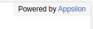
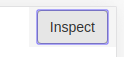
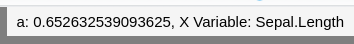

```{r, echo = FALSE, message = FALSE}
knitr::opts_chunk$set(
  collapse = TRUE,
  comment = "#>",
  fig.path = "inst/assets/README_files",
  out.width = "100%"
)
suppressWarnings(library(shiny.info))
```

<link href="http://fonts.googleapis.com/css?family=Maven+Pro:400,700|Inconsolata" rel="stylesheet" type="text/css">
<link href='docs/style.css' rel='stylesheet' type='text/css'>

shiny.info
===========


<div class="subheader">
Display simple information of the [shiny](https://shiny.rstudio.com/) project in the user interface of the app.
</div>

</br>

<center>
<!-- badges: start -->
[](https://cran.r-project.org/package=shiny.info)
[](https://github.com/Appsilon/shiny.info/actions?workflow=R-CMD-check)
[](https://codecov.io/gh/Appsilon/shiny.info?branch=master)
<!-- badges: end -->
</br>

<a href='https://github.com/Appsilon/shiny.info'></a>

</center>

<div class="section level2">

How to install shiny.info?
---------------

You can install shiny.info from CRAN repository:

```
install.packages("shiny.info")
```

You can get the most recent version from this repo using [devtools](https://github.com/hadley/devtools).

```
devtools::install_github("Appsilon/shiny.info")
```

How to use shiny.info?
-----------

Just add one of the `shiny.info` functions to the UI of your app (some features require also adding a little bit of code to the server function). Check [features section](#basic-features) and [documentation](https://cran.r-project.org/web/packages/shiny.info/shiny.info.pdf) for more details.

An example of a shiny app that uses `shiny.info` can be found in `./examples` directory.


Basic features
-------

* display a simple text message:
  ```
  shiny.info::display("Hello user!", position = "top right")
  ```
  
* show information about git branch, commit and changes:
  ```
  shiny.info::git_info()
  ```
  
* add "powered by" information with link:
  ```
  shiny.info::powered_by("Appsilon", link = "appsilon.com")
  ```
  
* show app version:
  ```
  # global variable:
  VERSION <- "1.2.2"

  # in app ui
  shiny.info::version()
  ```
  
* show a busy spinner when app is calculating:
  ```
  shiny.info::busy()
  ```
  
* group multiple messages in one panel:
  ```
  shiny.info::info_panel(
      shiny.info::git_info(),
      shiny.info::powered_by("Appsilon", link = "appsilon.com"),
      position = "bottom left"
    )
  ```
  

Advanced features
-------

* render value (eg. input, reactive value) from the server:
  ```
  # in app ui
  shiny.info::info_value("test_info_value")

  # in app server
  some_value <- reactiveVal("a test value to display")
  output$test_info_value <- shiny.info::render_info_value(some_value())
  ```
  
* render information about the session:
  ```
  # in app ui
  shiny.info::info_value("session_info_value")

  # in app server
  output$session_info_value <- shiny.info::render_session_info()
  ```
  
* debug app using `browser()` function just by clicking a button:
  ```
  # in app ui
  shiny.info::inspect_btn_ui()

  # in app server
  shiny.info::inspect_btn_server(input)
  ```
  
* toggle display with a key shortcut:
  ```
  shiny.info::toggle_info("Ctrl+Shift+K")
  ```
  
* show custom message using global variables:

  ```
  # the packages git2r and glue are loaded as dependencies
  
  # in app global
  VERSION = "1.2.2"
  REPO = git2r::repository_head(repository("."))[[1]]
  GIT_COMMIT_MESSAGE = git2r::commits(repository("."))[[1]]$message
  GIT_COMMIT_HASH = git2r::commits(repository("."))[[1]]$sha

  # in app ui
  shiny.info::display(
      message = glue::glue("I am running on repository {REPO} 
      from [{GIT_COMMIT_HASH}]: {GIT_COMMIT_MESSAGE}, 
      and this is version: {VERSION}"), 
      position = "top right", 
      type = "custom_message"
      )
  ```
  
  
  * show custom message using reactive variables:
  ```
  # the packages git2r and glue are loaded as dependencies
  
  # in app ui
  shiny.info::info_value("test_info_value", position = "top right")

  # in app server
    a <- reactive({
      input$xcol
      rnorm(1,1)
    })

    output$test_info_value <- shiny.info::render_info_value(glue::glue("a: {a()}, 
    X Variable: {input$xcol}"), add_name = FALSE)
  ```
  


How can I contribute?
-----------------
If you want to contribute to this project please submit a regular PR once you're done with your new feature or bug fix.<br>

**Changes in documentation**

Both repository **README.md** file and an official documentation page are generated with Rmarkdown, so if there is a need to update them, please modify accordingly with a **README.Rmd** file and use [readmebuilder](https://github.com/Appsilon/readmebuilder) package to render the new README.

In most cases a simple call of:

```r
readmebuilder::build_readme()
```

is enough.

Appsilon Data Science
------------------

Get in touch [dev@appsilon.com](dev@appsilon.com)

</div>
