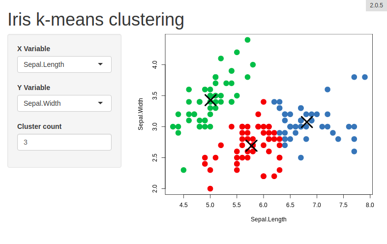

<link href="http://fonts.googleapis.com/css?family=Maven+Pro:400,700|Inconsolata" rel="stylesheet" type="text/css">
<link href='docs/style.css' rel='stylesheet' type='text/css'>

# shiny.info <a href='https://github.com/Appsilon/shiny.info'></a>

<div class="subheader">

Display simple information of the [shiny](https://shiny.rstudio.com/)
project in the user interface of the app.

</div>

</br>

<!-- badges: start -->

[](https://cran.r-project.org/package=shiny.info)
[](https://github.com/Appsilon/shiny.info/actions?workflow=R-CMD-check)
[](https://codecov.io/gh/Appsilon/shiny.info?branch=master)
<!-- badges: end -->

<div class="section level2">

## How to install?

You can install shiny.info from CRAN repository:

    install.packages("shiny.info")

The most recent version you can get from this repo using
[devtools](https://github.com/hadley/devtools).

    devtools::install_github("Appsilon/shiny.info")

## How to use?

Just add one of the `shiny.info` functions to the UI of your app (some
features require also adding a little bit of code to the server
function). Check [features section](#basic-features) and
[documentation](https://cran.r-project.org/web/packages/shiny.info/shiny.info.pdf)
for more details.

An example of shiny app that uses `shiny.info` can be found in
`./examples` directory.



## Basic features

  - simple text message:
    
        shiny.info::display("Hello user!", position = "top right")

  - git information:
    
        shiny.info::git_info()

  - “powered by” information with link:
    
        shiny.info::powered_by("Appsilon", link = "appsilon.com")

  - version:
    
        # global variable:
        VERSION <- "1.2.1"
        
        # in app ui
        shiny.info::version()

  - busy spinner
    
        shiny.info::busy()

  - group multiple messages in one panel
    
        shiny.info::info_panel(
            shiny.info::git_info(),
            shiny.info::powered_by("Appsilon", link = "appsilon.com"),
            position = "bottom left"
          )

## Advanced features

  - render value from the server
    
        # in app ui
        shiny.info::info_value("test_info_value")
        
        # in app server
        some_value <- reactiveVal("a test value to display")
        output$test_info_value <- shiny.info::render_info_value(some_value())

  - render informations about the session
    
        # in app ui
        shiny.info::info_value("session_info_value")
        
        # in app server
        output$session_info_value <- shiny.info::render_session_info()

  - debug app using `browser()` function just by clicking a button
    
        # in app ui
        shiny.info::inspect_btn_ui()
        
        # in app server
        shiny.info::inspect_btn_server(input)

  - toggle display with a key shortcut
    
        shiny.info::toggle_info("Ctrl+Shift+K")

## How to contribute?

If you want to contribute to this project please submit a regular PR,
once you’re done with new feature or bug fix.<br>

**Changes in documentation**

Both repository **README.md** file and an official documentation page
are generated with Rmarkdown, so if there is a need to update them,
please modify accordingly a **README.Rmd** file and use
[readmebuilder](https://github.com/Appsilon/readmebuilder) package to
render the new README.

In most cases a simple call of:

``` r
readmebuilder::build_readme()
```

is enough.

## Appsilon Data Science

Get in touch [dev@appsilon.com](dev@appsilon.com)

</div>
